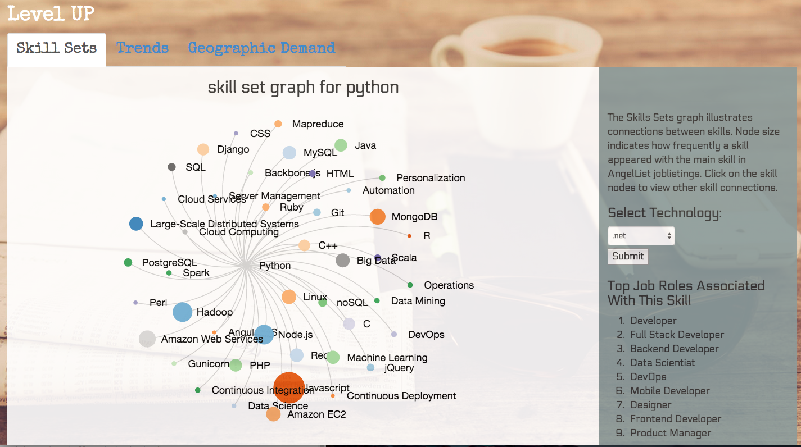
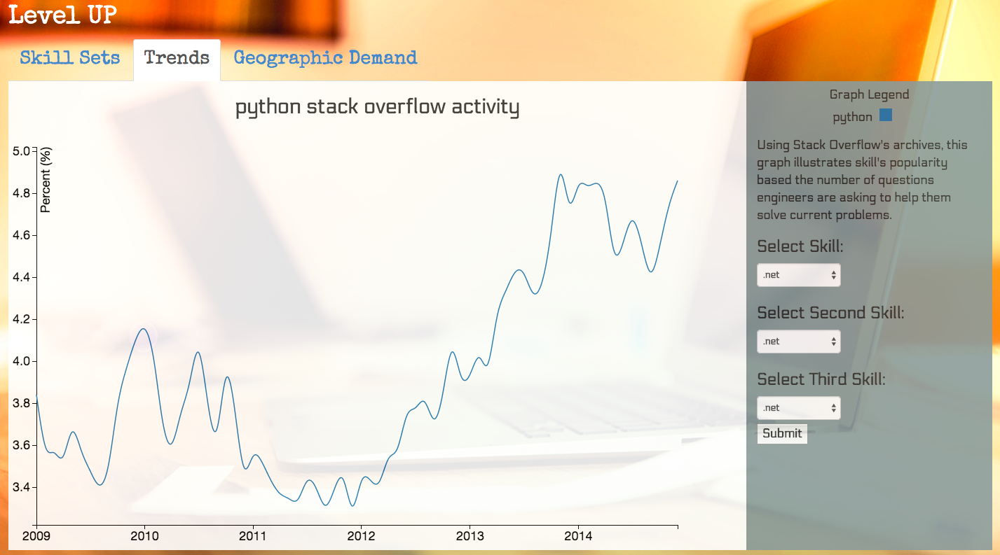
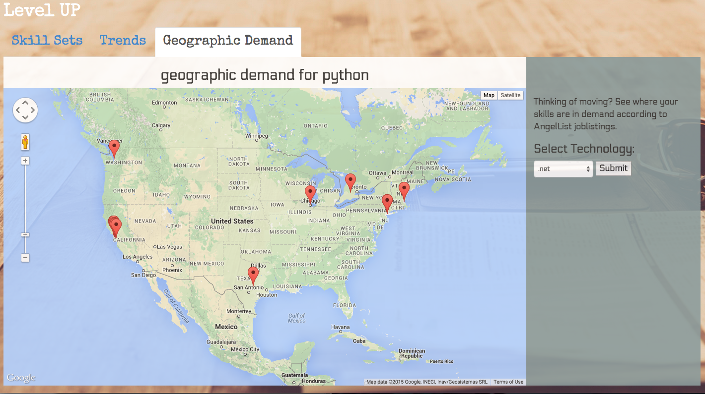

# LevelUp_HB_project

Level UP
========

One of the most rewarding and challenging aspects of being a software engineer is keeping your skills up-to-date. But how do you know what new skill to focus on? Inspired by my experience as a technical recruiter, Level UP is designed to help software engineers stay relevant in the industry by knowing what skills employers are looking for, where geographic demand is the highest, and what skills have faired the best over time. Level UP utilizes D3 and Google Maps to visualize data from AngelList's job listing and Stack Overflow's archives to help users make more informed decisions to help them level up in their careers.

####Contents
- [Tech](#tech)
- [Landing Page](#landing-page)
- [Skill Sets Tab](#skill-sets-tab)
- [Trends Tab](#trends-tab)
- [Geographic Demand](#geographic-demand)
- [Future Plans](#future-plans)

####Tech

Level UP uses:

	* Python
	* Flask Server
	* SQLite3 Database
	* SQLAlchemy
	* AngelList API
	* Google Maps  API
	* D3.js
	* Javascript
	* jQuery
	* Underscore.js
	* JSON 
	* AJAX
	* HTML/CSS
	* Bootstrap
	* Trello 

####Landing Page
	
The Landing Page establishes the purpose of the Level UP and asks the user to select a skill they are interested in. This skill is stored in a Flask server session and is used to render the initial graphs when each tab loads.

####Skill Sets Tab

The Skill Sets tab represents the connection between skills with a D3.js force node layout graph based upon the results of AngelList's current joblistings. 

An AJAX call sends the skill name retrieved from a session cookie or a dropdown selections. The server side sends an API call to AngelList filtered by the selected skill, and the API call returns several pages of job listings. The python script parses through individual job listing for other skill tags and for role tags(job titles). Skills are stored in a dictionary (skill name: number of occurrences), which is JSONified and sent to the front end. The original JSON objects are also cached in a SQLite database, which "expire" after three days. Using Javascript, jQuery, Underscore.js, the JSON dictionary is parsed and bound to D3.js node and link elements to create the force layout graph. The node size is based on how many times the node's skill appeared in job listings with the main skill. Each node is also assigned a mouse click event handler, which triggers another API call to AngelList based on the selected node's skill tag. The role tag dictionary data is also parsed and dynamically inserted into an ordered list in the DOM using jQuery. The graph's title dynamically updates each time a new graph is created. 

####Trends Tab
	
The Trends tab uses D3.js to graph question activity for a specific skill compared to overall question activity on Stack Overflow. This is meant to help users assess whether a selected skill is on its way up or out.

It takes over 2400 API calls to gather all the information regarding single skill's question activity since Stack Overflow's founding in 2008. So instead of dynamic API calls, this graph is create from API information stored in a SQLite database. Flask uses SQLAlachemy to query all stored information about a skill. A skill's activity during a specific period is divided by all Stack Overflow questions from that same time period. This information is stored in a python dictionary (time period: percentage of activity) and then JSONified to be sent to the front end. Javascript then parses out this information and creates a D3.js nested dictionary structure, which allows for scalability . Line colors are dynamically assigned and the legend is inserted into the DOM dynamically to allow for further scalability in the future.   

####Geographic Demand

The Geographic Demand chart uses the Google Maps' API along with the AngelList API to represent where current jobs are located. 

Just like the Skill Set tab, the Trends tab route sends an API call to AngelList filtering for a specific skill. Location tags are parsed out from the API reply and the city locations are converted to a Google GeoJSON object. This is passed to the frontend via an AJAX call, and parsed into a list to create the individual map markers. 

####Future Plans

In the future I hope to add a few important aspects to expand user experience. I would love for the user to be able to click on map markers and be taken to the individual job listing. I would also like to take advantage of the scalability built into the Trends graph and allow for users to compare as many skills as they like. My greatest ambition is to add a fourth tab that uses machine learnng to detect emerging skills. 
